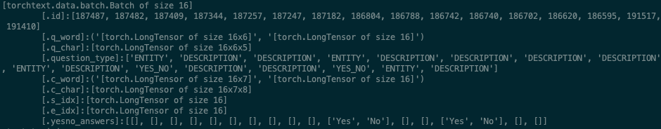

# 机器阅读理解(Machine Comprehension)

## data preprocess
处理方法一:
1. 使用预先处理的已经分词的数据
2. 使用一个sample的字段有：

                “question_id”: ,
                "question_type": ,
                "segmented_question": ,
                "documents": [
                                    ["segmented_title":   ,  "segmented_paragraphs": []] ，
                                    ["segmented_title":   ,  "segmented_paragraphs": []],
                                    ["segmented_title":   ,  "segmented_paragraphs": []].
                           ]
                "segmented_answers": [ ] ,
 3. 仅仅使用前三篇的document, 使用每个document的所有title+paragraph替换paragraph（保证截取文本的长度不超过预先设置的最大长度(500)）
 4. 计算各个paragraph和问题的BLUE-4分数，以衡量paragraph和问题的相关性，在分数前K的paragraph中，选择最早出现的paragraph.
  (paragraph选好了)
5. 对于每个答案，在paragraph中选择与答案F1分数最高的片段，作为这个答案的参考答案片段；如果只有一个答案的模型，
选择任意一个答案或者F1分数最高的那个答案对应的最佳的片段作为参考答案片段，训练时使用。

处理方法一之后的结果(torchText)：

